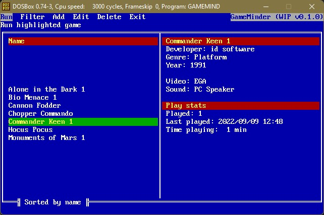

# GameMinder
## :video_game: A lightweight DOS games launcher to let you easily find and launch your games

)

GameMinder was created after I took a holiday in Summer 2022 with my [Toshiba Libretto 100CT](https://www.strifestreams.com/search/libretto) and found navigating through DOS and attempting to identify all my names purely through 8 character file and directory names a little tricky. I also had issues remembering which of my games were just demos, weren't setup or ran with issues.

Through these frustrations I decided to scratch this specific itch by creating a lightweight DOS games launcher which could store meta data about each of the games. This allows for games to be grouped by genre, released date or to just check if a particular game has been setup on your system.

The UI is a tribute to [PathMinder](https://en.wikipedia.org/wiki/PathMinder) which is an DOS explorer utility I've fond memories of using whilst growing up.

GameMinder also keeps track on when you've played a specific game and for how long. This is used to provide you with statistics and allow sorting of your games by popularity.

## 📑 [Changelog](https://github.com/MaverickUK/GameMinder/wiki/Changelog)
## 🗺️ [Roadmap](https://github.com/MaverickUK/GameMinder/wiki)
## :computer: [Design](https://github.com/MaverickUK/GameMinder/wiki/Design)

## :clap: Credits
Helpful resources used in the creation of GameMinder
* [ExecWithSwap](https://www.pcorner.com/list/PASCAL/EXECSW13.ZIP/INFO/) - Allows execution of external program whilst leaving only a small 2K memory stub

### Useful resources
* [ASCII codes lookup](https://www.ascii-codes.com/)
* [Keyboard scan codes](https://www.freepascal.org/docs-html/rtl/keyboard/kbdscancode.html)
* [Pascal programming](https://www.tutorialspoint.com/pascal/)
* [Pascal runtime error codes](https://there10han.wordpress.com/programming/pascal/free-pascal-exitcoderuntime-error-code/)
